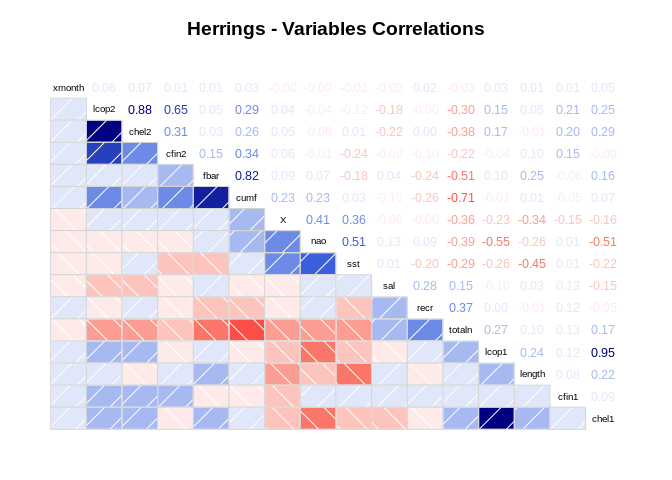
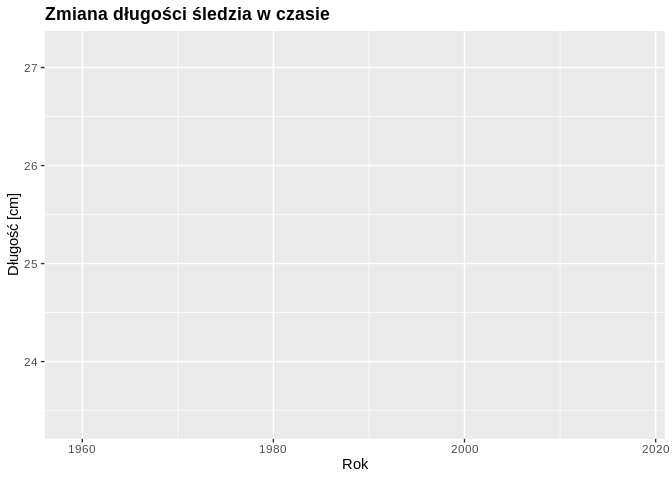

## Podsumowanie analizy

Histogram długości śledzia w zależności od liczby ryb jest bliski rozkładowi normalnemu. Po zwizualizowaniu pozostałych zmiennych od długości widać, że zależności wykazują głównie temperatura wody przy powierzchni i oscylacja północnoatlantycna, a mniej natężenie połowów w regionie: już na podstawie wykresu, można stwierdzić powiązanie ze sobą tych danych.

Najsilniejsze korelacje wystąpiły pomiędzy parami zmiennych: (Dostępność planktonu Calanus helgolandicus gatunku 1; Zagęszczenie widłonogów), (Natężenie połowów w regionie; Łączne roczne natężenie połowów w regionie), (Dostępność planktonu Calanus helgolandicus gatunku 2; Zagęszczenie widłonogów gatunku 2), (Łączna liczba ryb złowionych w ramach połowu; Łączne roczne natężenie połowów w regionie). Oznacza to, że najprawdopodobniej pozbycie się jednej ze zmiennych z każdej z par pozwoliłoby na uproszczenie modelu, redukcję efektu przeuczenia i skrócenie czasu uczenia.

Stworzono dwa regresory. Pierwszym jest rozwiązanie podstawowe, czyli regresja liniowa, która osiągnęła trafność na poziomie 35%. Drugi został wytrenowany z wykorzystaniem Generalized Boosted Regression Modelling (GBM) z 10-krotną walidacją krzyżową, a maksymalną trafnością była wartość oscylująca wokół 51%.

W latach 1958 - 1978 można zauważyć stabilny wzrost rozmiaru śledzia. W okolicy roku 1978 śledź osiągał swoje najwieksze rozmiary tj. ok. 27,2 cm. Jednakże w po roku 1978 zanotowano kilka gwałtownych spadków długości śledzia. Ostatecznie długość śledzia wyraźnie spadała aż do roku 2018, do poziomu ok 23,5cm. 

W wyniku przeprowadzone analizy okazało się, że najlepsze dopasowanie modelu osiągane jest dla ... zmiennych. Najistotniejszymi zmiennymi w modelu okazały się ..., ..., ..., ..., ....

# Kod i wyniki analizy

## Załadowanie bibliotek

```r
library(zoo)
```

```
## 
## Attaching package: 'zoo'
```

```
## The following objects are masked from 'package:base':
## 
##     as.Date, as.Date.numeric
```

```r
library(dplyr)
```

```
## 
## Attaching package: 'dplyr'
```

```
## The following objects are masked from 'package:stats':
## 
##     filter, lag
```

```
## The following objects are masked from 'package:base':
## 
##     intersect, setdiff, setequal, union
```

```r
library(corrgram)
```

```
## Registered S3 method overwritten by 'seriation':
##   method         from 
##   reorder.hclust gclus
```

```r
library(ggplot2)
library(tidyverse)
```

```
## ── Attaching packages ─────────────────────────────────────────────────────────────── tidyverse 1.3.0 ──
```

```
## ✔ tibble  2.1.3     ✔ purrr   0.3.3
## ✔ tidyr   1.0.0     ✔ stringr 1.4.0
## ✔ readr   1.3.1     ✔ forcats 0.4.0
```

```
## ── Conflicts ────────────────────────────────────────────────────────────────── tidyverse_conflicts() ──
## ✖ dplyr::filter() masks stats::filter()
## ✖ dplyr::lag()    masks stats::lag()
```

```r
library(lubridate)
```

```
## 
## Attaching package: 'lubridate'
```

```
## The following object is masked from 'package:base':
## 
##     date
```

```r
library(fredr)
library(cowplot)
```

```
## 
## ********************************************************
```

```
## Note: As of version 1.0.0, cowplot does not change the
```

```
##   default ggplot2 theme anymore. To recover the previous
```

```
##   behavior, execute:
##   theme_set(theme_cowplot())
```

```
## ********************************************************
```

```
## 
## Attaching package: 'cowplot'
```

```
## The following object is masked from 'package:lubridate':
## 
##     stamp
```

```r
library(data.table)
```

```
## 
## Attaching package: 'data.table'
```

```
## The following objects are masked from 'package:lubridate':
## 
##     hour, isoweek, mday, minute, month, quarter, second, wday, week,
##     yday, year
```

```
## The following object is masked from 'package:purrr':
## 
##     transpose
```

```
## The following objects are masked from 'package:dplyr':
## 
##     between, first, last
```

```r
library(gganimate)
library(data.table)
library(gifski)
library(png)
library(caret)
```

```
## Loading required package: lattice
```

```
## 
## Attaching package: 'lattice'
```

```
## The following object is masked from 'package:corrgram':
## 
##     panel.fill
```

```
## 
## Attaching package: 'caret'
```

```
## The following object is masked from 'package:purrr':
## 
##     lift
```

```r
library(pROC)
```

```
## Type 'citation("pROC")' for a citation.
```

```
## 
## Attaching package: 'pROC'
```

```
## The following objects are masked from 'package:stats':
## 
##     cov, smooth, var
```

## Zapewnienie powtarzalności eksperymentów

```r
set.seed(23)
```


## Ładowanie danych

```r
herrings_raw_top <- read.csv(file='https://raw.githubusercontent.com/mateuszskiba/emd-1/master/sledzie.csv?token=AFU5A4AIIMA5QAADFMACAFS55ZYIY', header=TRUE, sep=',', na.strings='?', nrows=100)
classes <- sapply(herrings_raw_top, class)
herrings_raw <- read.csv(file='https://raw.githubusercontent.com/mateuszskiba/emd-1/master/sledzie.csv?token=AFU5A4AIIMA5QAADFMACAFS55ZYIY', header=TRUE, sep=',', na.strings='?', colClasses=classes)
```

## Przetworzenie brakujących danych

```r
herrings <- 
  herrings_raw %>%
  do(na.locf(.))
```

Z uwagi na to, że w zbiorze danych wpisy z jednego połowu występują po sobie, a więc zawierają większość tych samych parametrów, dlatego zdecydowano się uzupełniać brakujące wartości bazując na wartościach wpisu powyżej. W związku z tym, pierwszy wpis został usunięty, gdyż nie posiadał on wpisu, na podstawie którego możnaby uzupełnić jego brakującą wartość.

```r
head(herrings)
```

```
##   X length   cfin1   cfin2   chel1    chel2   lcop1    lcop2  fbar   recr
## 2 1   22.5 0.02778 0.27785 2.46875 21.43548 2.54787 26.35881 0.356 482831
## 3 2   25.0 0.02778 0.27785 2.46875 21.43548 2.54787 26.35881 0.356 482831
## 4 3   25.5 0.02778 0.27785 2.46875 21.43548 2.54787 26.35881 0.356 482831
## 5 4   24.0 0.02778 0.27785 2.46875 21.43548 2.54787 26.35881 0.356 482831
## 6 5   22.0 0.02778 0.27785 2.46875 21.43548 2.54787 26.35881 0.356 482831
## 7 6   24.0 0.02778 0.27785 2.46875 21.43548 2.54787 26.35881 0.356 482831
##        cumf   totaln      sst      sal xmonth nao
## 2 0.3059879 267380.8 14.30693 35.51234      7 2.8
## 3 0.3059879 267380.8 14.30693 35.51234      7 2.8
## 4 0.3059879 267380.8 14.30693 35.51234      7 2.8
## 5 0.3059879 267380.8 14.30693 35.51234      7 2.8
## 6 0.3059879 267380.8 14.30693 35.51234      7 2.8
## 7 0.3059879 267380.8 14.30693 35.51234      7 2.8
```

## Rozmiar zbioru i podstawowe statystyki

```r
dim(herrings)
```

```
## [1] 52581    16
```

```r
summary(herrings)
```

```
##        X             length         cfin1             cfin2        
##  Min.   :    1   Min.   :19.0   Min.   : 0.0000   Min.   : 0.0000  
##  1st Qu.:13146   1st Qu.:24.0   1st Qu.: 0.0000   1st Qu.: 0.2778  
##  Median :26291   Median :25.5   Median : 0.1111   Median : 0.7012  
##  Mean   :26291   Mean   :25.3   Mean   : 0.4463   Mean   : 2.0255  
##  3rd Qu.:39436   3rd Qu.:26.5   3rd Qu.: 0.3333   3rd Qu.: 1.7936  
##  Max.   :52581   Max.   :32.5   Max.   :37.6667   Max.   :19.3958  
##      chel1            chel2            lcop1              lcop2       
##  Min.   : 0.000   Min.   : 5.238   Min.   :  0.3074   Min.   : 7.849  
##  1st Qu.: 2.469   1st Qu.:13.427   1st Qu.:  2.5479   1st Qu.:17.808  
##  Median : 5.750   Median :21.435   Median :  7.0000   Median :24.859  
##  Mean   :10.004   Mean   :21.218   Mean   : 12.8029   Mean   :28.423  
##  3rd Qu.:11.500   3rd Qu.:27.193   3rd Qu.: 21.2315   3rd Qu.:37.232  
##  Max.   :75.000   Max.   :57.706   Max.   :115.5833   Max.   :68.736  
##       fbar             recr              cumf             totaln       
##  Min.   :0.0680   Min.   : 140515   Min.   :0.06833   Min.   : 144137  
##  1st Qu.:0.2270   1st Qu.: 360061   1st Qu.:0.14809   1st Qu.: 306068  
##  Median :0.3320   Median : 421391   Median :0.23191   Median : 539558  
##  Mean   :0.3304   Mean   : 520367   Mean   :0.22981   Mean   : 514978  
##  3rd Qu.:0.4560   3rd Qu.: 724151   3rd Qu.:0.29803   3rd Qu.: 730351  
##  Max.   :0.8490   Max.   :1565890   Max.   :0.39801   Max.   :1015595  
##       sst             sal            xmonth            nao          
##  Min.   :12.77   Min.   :35.40   Min.   : 1.000   Min.   :-4.89000  
##  1st Qu.:13.60   1st Qu.:35.51   1st Qu.: 5.000   1st Qu.:-1.89000  
##  Median :13.86   Median :35.51   Median : 8.000   Median : 0.20000  
##  Mean   :13.87   Mean   :35.51   Mean   : 7.258   Mean   :-0.09241  
##  3rd Qu.:14.16   3rd Qu.:35.52   3rd Qu.: 9.000   3rd Qu.: 1.63000  
##  Max.   :14.73   Max.   :35.61   Max.   :12.000   Max.   : 5.08000
```

W zbiorze mamy 52581 wpisów, zawierających 15 kolumn. Rozkład wartości i najważniejsze statystyki przedstawia wynik wywołania funkcji summary. Jedyną zmienną, która przyjmuje wartości ujemne jest oscylacja północnoatlantycka.

## Szczegółowa analiza wartości atrybutów

```r
ggplot(herrings, aes(x=length)) + geom_histogram(binwidth=1, colour="black", fill="white")
```

<!-- -->

Histogram rozkładu długości w zbiorze. Minimalna wartość wynosi 19cm, maksymalna 32,5cm.

```r
herrings_sst <- herrings %>%
  group_by(sst) %>%
  summarise_all(list(mean))

ggplot(
  herrings_sst,
  aes(x=sst,
      y=length,
      color=nao
  )
) +
geom_point() + geom_smooth(method='lm')
```

<!-- -->

W celu sprawdzenia zależności pomiędzy zmiennymi a długością śledzia pogrupowano wpisy po wartości danego parametru (w tym przypadku temperatury przy powierzchni wody [°C]), następnie zwizualizowano punkty na wykresie jednocześnie dodając krzywą będącą najbliższym modelem liniowym tej zależności. Na tym wykresie zawarte zostały dwie wartości (drugą jest oscylacja północnoatlantycka [mb]), które mają największy wpływ na długość.

```r
herrings_nao <- herrings %>%
  group_by(nao) %>%
  summarise_all(list(mean))

ggplot(
  herrings_nao,
  aes(x=nao,
      y=length
  )
) +
geom_point() + geom_smooth(method='lm')
```

<!-- -->

Zależność długości od oscylacji północnoatlantyckiej [mb]. Na wykresie można zobaczyć pewną relację pomiędzy zmiennymi.

```r
herrings_fbar <- herrings %>%
  group_by(fbar) %>%
  summarise_all(list(mean))

ggplot(
  herrings_fbar,
  aes(x=fbar,
      y=length
  )
) +
geom_point() + geom_smooth(method='lm')
```

<!-- -->

Zależność długości od natężenia połowu w regionie [ułamek pozostawionego narybku].

```r
herrings_chel1 <- herrings %>%
  group_by(chel1) %>%
  summarise_all(list(mean))

ggplot(
  herrings_chel1,
  aes(x=chel1,
      y=length
  )
) +
geom_point() + geom_smooth(method='lm')
```

<!-- -->

Zależność długości od dostępności planktonu Calanus helgolandicus gat. 1. Duże znaczenie w przypadku ustalenia kierunku nachylenia prostej miały obserwacje odstające, znajdujące się po prawej stronie wykresu. Zaobserwować można jedynie słabą zależność.

```r
herrings_sal <- herrings %>%
  group_by(sal) %>%
  summarise_all(list(min))

ggplot(
  herrings_sal,
  aes(x=sal,
      y=length
  )
) +
geom_point() + geom_smooth(method='lm')
```

<!-- -->

Zależność długości od poziomu zasolenia wody [Knudsen ppt]. Podobnie jak powyżej, regresja liniowa nie wyjaśnia zależności zmiennych w sposób satysfakcjonujący.

## Korelacje między zmiennymi
Na poniższej grafice można zauważyć, iż długość śledzia jest najsilniej skorelowana z takimi zmiennymi jak: Temperatura wody (**-0.45**); Oscylacja północnoatlantycka (**-0.26**), Natężenie połowów w regionie (**0.25**) oraz Dostępność planktonu Calanus helgolandicus gatunek 2 (**0.22**).


Inne spostrzeżenia:

* Silna korelacja pomiędzy Dostępnością planktonu Calanus helgolandicus gatunku 1 a Zagęszczeniem widłonogów gatunku 1: **0.95**
* Silna korelacja pomiędzy Dostępnością planktonu Calanus helgolandicus gatunku 2 a Zagęszczeniem widłonogów gatunku 2: **0.88**
* Silne korelacja pomiędzy Natężeniem połowów w regionie oraz Łącznym rocznym natężeniem połowów w regionie: **0.82** (jako że obie zmienne odwołują się do natężenia połowów, oczywistym jest występująca zależność)
* Silna korelacja pomiędzy Łączną liczbą ryb złowionych w ramach połowu oraz Łącznym rocznym natężeniem połowów w regionie: **-0.71** (z racji, iż im więcej ryb zostało złowionych tym mniejsza jest liczba pozostawionego narybku)


```r
corrgram(herrings, order=TRUE, lower.panel=panel.shade,
         upper.panel=panel.cor, text.panel=panel.txt,
         main="Herrings - Variables Correlations")
```

<!-- -->

## Animacja

Animacja pokazuje jak na przestrzeniu 60 lat zmieniał się rozmiar trzyletniego śledzia oceanicznego wyławianego w Europie.
Można zauważyć, iż od 1958 do ok. 1978 roku długość śledzia wzrastała, by w roku 1978 osiągnąć swoją maksymalną wartość tj. ok 27,2cm. Następnie odnotowano trzy istotne spadki długości śledzia w okolicy lat 1984, 1990 i 1997. Długośc ta długość ta systematycznie spadała, by w 2018 roku osiągnąć wartość ok 23,5cm.


### Przygotowanie danych

```r
herrings_animation <- 
  herrings %>%
  mutate(yearn=ceiling(X/(max(X)/90))) %>% 
  select(yearn, length) %>%
  group_by(yearn) %>%
  summarize(length = mean(length))%>%
  mutate(yearn=(2018 - (60 - ceiling(yearn/(max(yearn)/60)))))
```

### Stworzenie animacji

```r
a <- 
  ggplot(data=herrings_animation,aes(x=yearn,y=length))+
  geom_line()+
  theme(legend.position="none")+
  scale_y_continuous(breaks=c(22, 23, 24, 25, 26, 27))+
  scale_x_continuous()+
  labs(title="Zmiana długości śledzia w czasie",
       x="Rok",
       y="Długość [cm]")+
  theme(plot.title=element_text(face="bold"),
        plot.caption=element_text(hjust=0))+
  transition_reveal(yearn)

animate(a, fps = 10, duration = 10, renderer = gifski_renderer())
```

<!-- -->

## Próba stworzenia regresora
### Regresja logistyczna

```r
# Podział zbiorów
idx <- createDataPartition(herrings$length, times=2, p=0.25, list=FALSE)
idxTest <- idx[,1]
idxVal <- idx[,2]

train <- herrings[-c(idxTest, idxVal),]
test <- herrings[idxTest,]
val <- herrings[idxVal,]

# Wykres
ggplot(mapping=aes(alpha=0.4)) + 
  geom_density(aes(length, fill="train"), train) + 
  geom_density(aes(length, fill="test"), test) + 
  geom_density(aes(length, fill="val"), val)
```

<!-- -->

```r
# Trenowanie regresora
fit <- train(length ~ .,
             data = train,
             method = "lm")
fit
```

```
## Linear Regression 
## 
## 29579 samples
##    15 predictor
## 
## No pre-processing
## Resampling: Bootstrapped (25 reps) 
## Summary of sample sizes: 29579, 29579, 29579, 29579, 29579, 29579, ... 
## Resampling results:
## 
##   RMSE      Rsquared   MAE     
##   1.335171  0.3511481  1.052215
## 
## Tuning parameter 'intercept' was held constant at a value of TRUE
```

```r
# Predykcja
regFloatLength <- predict(fit,
                          newdata = test)
regLength <- round(regFloatLength)

# Macierz pomyłek
confusionMatrix(data = factor(regLength, levels=min(test$length):max(test$length)),
                factor(test$length, levels=min(test$length):max(test$length)))
```

```
## Confusion Matrix and Statistics
## 
##           Reference
## Prediction  20  21  22  23  24  25  26  27  28  29  30  31  32
##         20   0   0   0   0   0   0   0   0   0   0   0   0   0
##         21   0   0   0   0   0   0   0   0   0   0   0   0   0
##         22   0   0   0   0   0   0   0   0   0   0   0   0   0
##         23   0   7  87 140 102  52   7   3   1   0   0   0   0
##         24   2  17  92 250 299 204  90  18   3   0   0   0   0
##         25   5  23  81 222 517 738 572 268  68   3   0   0   0
##         26   0   0   3  39 204 477 631 504 298  42   4   3   0
##         27   0   1   0   1   8  28 115 179 100  22   1   0   1
##         28   0   0   0   0   4   5  16  16  18   4   0   1   0
##         29   0   0   0   0   0   0   0   0   0   0   0   0   0
##         30   0   0   0   0   0   0   0   0   0   0   0   0   0
##         31   0   0   0   0   0   0   0   0   0   0   0   0   0
##         32   0   0   0   0   0   0   0   0   0   0   0   0   0
## 
## Overall Statistics
##                                           
##                Accuracy : 0.304           
##                  95% CI : (0.2929, 0.3152)
##     No Information Rate : 0.228           
##     P-Value [Acc > NIR] : < 2.2e-16       
##                                           
##                   Kappa : 0.1285          
##                                           
##  Mcnemar's Test P-Value : NA              
## 
## Statistics by Class:
## 
##                      Class: 20 Class: 21 Class: 22 Class: 23 Class: 24
## Sensitivity           0.000000  0.000000   0.00000   0.21472   0.26367
## Specificity           1.000000  1.000000   1.00000   0.95643   0.87624
## Pos Pred Value             NaN       NaN       NaN   0.35088   0.30667
## Neg Pred Value        0.998939  0.992723   0.96013   0.91738   0.85145
## Prevalence            0.001061  0.007277   0.03987   0.09885   0.17192
## Detection Rate        0.000000  0.000000   0.00000   0.02122   0.04533
## Detection Prevalence  0.000000  0.000000   0.00000   0.06049   0.14782
## Balanced Accuracy     0.500000  0.500000   0.50000   0.58558   0.56995
##                      Class: 25 Class: 26 Class: 27 Class: 28 Class: 29
## Sensitivity             0.4907   0.44095   0.18117  0.036885   0.00000
## Specificity             0.6546   0.69526   0.95061  0.992469   1.00000
## Pos Pred Value          0.2956   0.28617   0.39254  0.281250       NaN
## Neg Pred Value          0.8131   0.81781   0.86824  0.928047   0.98924
## Prevalence              0.2280   0.21695   0.14979  0.073984   0.01076
## Detection Rate          0.1119   0.09566   0.02714  0.002729   0.00000
## Detection Prevalence    0.3786   0.33429   0.06913  0.009703   0.00000
## Balanced Accuracy       0.5726   0.56810   0.56589  0.514677   0.50000
##                      Class: 30 Class: 31 Class: 32
## Sensitivity           0.000000 0.0000000 0.0000000
## Specificity           1.000000 1.0000000 1.0000000
## Pos Pred Value             NaN       NaN       NaN
## Neg Pred Value        0.999242 0.9993936 0.9998484
## Prevalence            0.000758 0.0006064 0.0001516
## Detection Rate        0.000000 0.0000000 0.0000000
## Detection Prevalence  0.000000 0.0000000 0.0000000
## Balanced Accuracy     0.500000 0.5000000 0.5000000
```

```r
# R^2
rsq <- function (x, y) cor(x, y) ^ 2
rsq(regFloatLength, test$length)
```

```
## [1] 0.3595724
```

### Generalized Boosted Regression Modelling (GBM) z 10-krotną walidacją krzyżową

```r
ctrl <- trainControl(
           method = "repeatedcv",
           number = 10,
           repeats = 10)
fit <- train(length ~ .,
             data = train,
             trControl = ctrl,
             method = "gbm")
```

```r
fit
```

```
## Stochastic Gradient Boosting 
## 
## 29579 samples
##    15 predictor
## 
## No pre-processing
## Resampling: Cross-Validated (10 fold, repeated 10 times) 
## Summary of sample sizes: 26620, 26621, 26621, 26621, 26622, 26621, ... 
## Resampling results across tuning parameters:
## 
##   interaction.depth  n.trees  RMSE      Rsquared   MAE      
##   1                   50      1.284940  0.4171814  1.0200430
##   1                  100      1.240942  0.4455455  0.9827947
##   1                  150      1.222317  0.4597785  0.9674031
##   2                   50      1.217955  0.4660263  0.9659751
##   2                  100      1.188397  0.4878838  0.9410949
##   2                  150      1.176180  0.4975001  0.9307090
##   3                   50      1.190739  0.4873878  0.9427559
##   3                  100      1.169496  0.5032398  0.9254789
##   3                  150      1.159773  0.5110528  0.9170468
## 
## Tuning parameter 'shrinkage' was held constant at a value of 0.1
## 
## Tuning parameter 'n.minobsinnode' was held constant at a value of 10
## RMSE was used to select the optimal model using the smallest value.
## The final values used for the model were n.trees = 150, interaction.depth =
##  3, shrinkage = 0.1 and n.minobsinnode = 10.
```

Trafność klasyfikacji osiągnęła wartość 51%.

```r
regFloatLength <- predict(fit,
                      newdata = test)
regLength <- round(regFloatLength)
confusionMatrix(data = factor(regLength, levels=min(regLength):max(regLength)),
                factor(test$length, levels=min(regLength):max(regLength)))
```

```
## Confusion Matrix and Statistics
## 
##           Reference
## Prediction  23  24  25  26  27  28
##         23 272 194 104  14   4   1
##         24 196 247 147  50   9   0
##         25 145 523 793 579 193  25
##         26  38 144 405 565 422 172
##         27   1  25  52 220 352 260
##         28   0   1   3   3   8  30
## 
## Overall Statistics
##                                           
##                Accuracy : 0.3645          
##                  95% CI : (0.3525, 0.3767)
##     No Information Rate : 0.2427          
##     P-Value [Acc > NIR] : < 2.2e-16       
##                                           
##                   Kappa : 0.199           
##                                           
##  Mcnemar's Test P-Value : < 2.2e-16       
## 
## Statistics by Class:
## 
##                      Class: 23 Class: 24 Class: 25 Class: 26 Class: 27
## Sensitivity            0.41718   0.21781    0.5273   0.39483    0.3563
## Specificity            0.94283   0.92060    0.6878   0.75220    0.8929
## Pos Pred Value         0.46180   0.38059    0.3512   0.32360    0.3868
## Neg Pred Value         0.93224   0.84012    0.8195   0.80544    0.8797
## Prevalence             0.10521   0.18299    0.2427   0.23092    0.1594
## Detection Rate         0.04389   0.03986    0.1280   0.09117    0.0568
## Detection Prevalence   0.09505   0.10473    0.3644   0.28175    0.1468
## Balanced Accuracy      0.68000   0.56921    0.6075   0.57352    0.6246
##                      Class: 28
## Sensitivity           0.061475
## Specificity           0.997373
## Pos Pred Value        0.666667
## Neg Pred Value        0.925553
## Prevalence            0.078748
## Detection Rate        0.004841
## Detection Prevalence  0.007262
## Balanced Accuracy     0.529424
```

```r
rsq(regFloatLength, test$length)
```

```
## [1] 0.5196145
```

```r
rsq(regLength, test$length)
```

```
## [1] 0.4890392
```

Trafność klasyfikacji w przypadkach zaokrąglania predykcji zmiennoprzecinkowych do liczb całkowitych oraz braku zaokrąglania.
## Analiza ważności atrybutów
Analiza ważności atrybutów została przeprowadzona z użyciem metody walidacji krzyżowej. Na podstawie wyników analizy można zauważyć, że najlepsze dopasowanie do danych (R^2) jest osiągnięte, gdy model posiada ... zmiennych. Natomiast najmniejszy RMSE jest osiągany przy zastosowniu ... zmiennych. 
Ponadto, najistotniejszymi zmiennymi w modelu okazały się ..., ..., ..., ..., ....


```r
ctrl <- rfeControl(functions = lmFuncs,
                   method = "repeatedcv",
                   repeats = 10,
                   verbose = FALSE)

lmProfile <- rfe(train[,-2],
                 train$length,
                 sizes=c(1:15),
                 rfeControl = ctrl)

lmProfile
```

```
## 
## Recursive feature selection
## 
## Outer resampling method: Cross-Validated (10 fold, repeated 10 times) 
## 
## Resampling performance over subset size:
## 
##  Variables  RMSE  Rsquared   MAE  RMSESD RsquaredSD    MAESD Selected
##          1 1.657 0.0006074 1.343 0.01343  0.0008482 0.008819         
##          2 1.497 0.1847824 1.194 0.01521  0.0120359 0.012534         
##          3 1.493 0.1885873 1.192 0.01523  0.0121507 0.012715         
##          4 1.400 0.2871425 1.113 0.01427  0.0124115 0.011788         
##          5 1.390 0.2975022 1.101 0.01498  0.0132239 0.012297         
##          6 1.389 0.2976961 1.101 0.01500  0.0131964 0.012259         
##          7 1.384 0.3030852 1.096 0.01491  0.0130674 0.012026         
##          8 1.378 0.3090504 1.092 0.01479  0.0129318 0.011854         
##          9 1.377 0.3098991 1.091 0.01488  0.0128234 0.011871         
##         10 1.376 0.3109318 1.089 0.01484  0.0127659 0.011935         
##         11 1.376 0.3109325 1.089 0.01486  0.0127788 0.011960         
##         12 1.376 0.3114281 1.089 0.01501  0.0129478 0.011993         
##         13 1.342 0.3444182 1.058 0.01573  0.0120838 0.013088         
##         14 1.336 0.3501850 1.053 0.01625  0.0125467 0.013417         
##         15 1.336 0.3504513 1.053 0.01621  0.0125003 0.013355        *
## 
## The top 5 variables (out of 15):
##    cumf, fbar, sal, sst, cfin1
```
